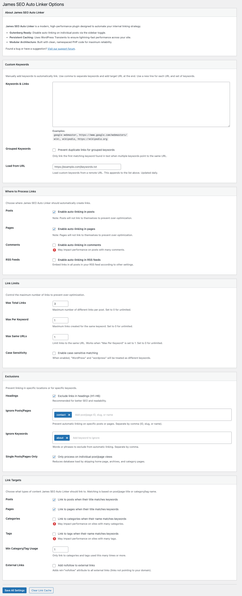

# James SEO Auto Linker

**James SEO Auto Linker** is a lightweight WordPress plugin that automatically adds links for keywords and phrases in your content, boosting your internal linking strategy and overall SEO.

## Features

- **Gutenberg Ready**: Integrated toggle in the Block Editor sidebar to disable auto-linking on a per-post basis.
- **Persistent Caching**: Leverages WordPress Transients for high-performance link generation that doesn't slow down your site.
- **Smart Internal Linking**: Automatically link keywords to posts, pages, categories, and tags based on their titles.
- **Custom Keyword Mapping**: Manually define keywords and their target URLs (supports internal and external links).
- **Advanced Control**: Set limits on links per page, per keyword, and per URL to avoid over-optimization.
- **Intelligent Exclusions**: Automatically skip headings (H1-H6) and specific post IDs or slugs.
- **Modern Architecture**: Built with a modular, namespaced PHP structure (PSR-4) for maximum reliability and ease of extension.
- **Translation Ready**: Full support for internationalization, including French translation.

## Installation

1. Upload the plugin files to the `/wp-content/plugins/james-seo-auto-linker` directory.
2. Activate the plugin through the 'Plugins' screen in WordPress.
3. Configure settings under **Settings > James SEO Auto Linker**.

## Changelog

### 1.0 (2026-02-12)
- Initial official release.
- Clean rebranding and optimized code.
- Added French translation support.

## Frequently Asked Questions

### Does this plugin affect site performance?
No, James SEO Auto Linker is built with performance in mind. It uses a smart Transient caching system to minimize database queries and ensure your content is processed efficiently.

### Can I link to external websites?
Yes! In the "Custom Keywords" section, you can specify any URL, including external sites.

### Can I prevent certain words from being linked?
Yes, you can add words or phrases to the "Ignore Keywords" list in the settings to exclude them from automatic linking.

### Can I disable auto-linking for a single post?
Yes, thanks to our new Gutenberg integration, you can find a toggle in the block editor sidebar to disable auto-linking for that specific post or page.

## Author
**James Colin**
